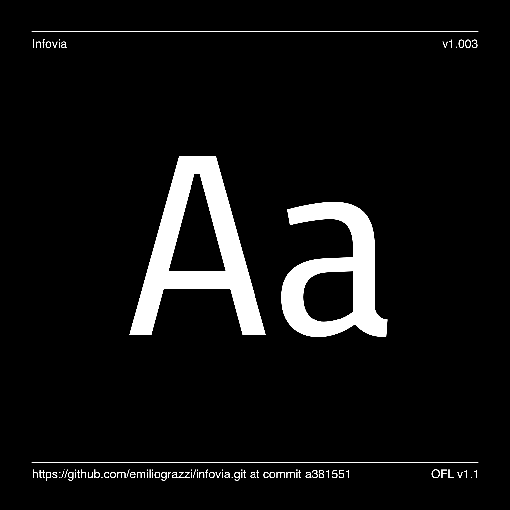

# Infovìa

[![][Fontbakery]](https://emiliograzzi.github.io/infovia/fontbakery/fontbakery-report.html)
[![][Universal]](https://emiliograzzi.github.io/infovia/fontbakery/fontbakery-report.html)
[![][GF Profile]](https://emiliograzzi.github.io/infovia/fontbakery/fontbakery-report.html)
[![][Outline Correctness]](https://emiliograzzi.github.io/infovia/fontbakery/fontbakery-report.html)
[![][Shaping]](https://emiliograzzi.github.io/infovia/fontbakery/fontbakery-report.html)

[Fontbakery]: https://img.shields.io/endpoint?url=https%3A%2F%2Fraw.githubusercontent.com%2Femiliograzzi%2Finfovia%2Fgh-pages%2Fbadges%2Foverall.json
[GF Profile]: https://img.shields.io/endpoint?url=https%3A%2F%2Fraw.githubusercontent.com%2Femiliograzzi%2Finfovia%2Fgh-pages%2Fbadges%2FGoogleFonts.json
[Outline Correctness]: https://img.shields.io/endpoint?url=https%3A%2F%2Fraw.githubusercontent.com%2Femiliograzzi%2Finfovia%2Fgh-pages%2Fbadges%2FOutlineCorrectnessChecks.json
[Shaping]: https://img.shields.io/endpoint?url=https%3A%2F%2Fraw.githubusercontent.com%2Femiliograzzi%2Finfovia%2Fgh-pages%2Fbadges%2FShapingChecks.json
[Universal]: https://img.shields.io/endpoint?url=https%3A%2F%2Fraw.githubusercontent.com%2Femiliograzzi%2Finfovia%2Fgh-pages%2Fbadges%2FUniversal.json

Infovìa is a typeface designed for wayfinding and signage purposes. It features a high x-height, open terminals and an increasing contrast in heavier weights. The letterforms were designed to save horizontal space, with several open-type features to enhance usability and ergonomics in editorial and signage environments. 

## About

Infovia is a spinoff from the typeface [Cairo](https://fonts.google.com/specimen/Cairo) and was developed by [ID Matter](www.idmatter.eu)

## Building

Fonts are built automatically by GitHub Actions - take a look in the "Actions" tab for the latest build.

If you want to build fonts manually on your own computer:

* `make build` will produce font files.
* `make test` will run [FontBakery](https://github.com/googlefonts/fontbakery)'s quality assurance tests.
* `make proof` will generate HTML proof files.

The proof files and QA tests are also available automatically via GitHub Actions - look at https://emiliograzzi.github.io/infovia.

## Changelog

**8 July 2023. Version 1.004**
- added zero.slashed feature 

**7 July 2023. Version 1.003**
- initial commit

## License

This Font Software is licensed under the SIL Open Font License, Version 1.1.
This license is available with a FAQ at
https://scripts.sil.org/OFL

## Repository Layout

This font repository structure is inspired by [Unified Font Repository v0.3](https://github.com/unified-font-repository/Unified-Font-Repository), modified for the Google Fonts workflow.
